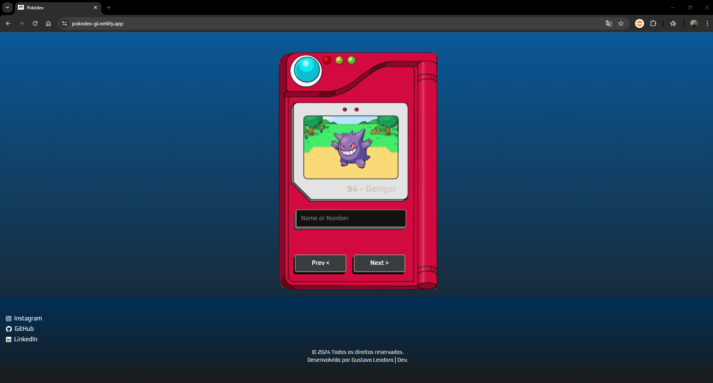

<h1 align="center">Pokédex Online</h1>

<h2 align="center">🚀 Tecnologias</h2>

<p align="center">
Esse projeto foi desenvolvido com as seguintes tecnologias:
</p>

- **HTML e CSS**: para estruturação e estilização da interface.
- **JavaScript**: para funcionalidade e interação com a API.
- **PokéAPI**: para fornecer informações sobre cada Pokémon.
- **Netlify**: para hospedagem e deploy contínuo.

<h2 align="center">💻 Projeto</h2>
<p align="center">
O sonho de todo fã de Pokémon é ter a Pokédex completa! Este projeto permite a consulta de todos os Pokémon com uma interface fácil de usar e adaptada para diferentes tamanhos de tela.
</p>

<h1 align="center">👉 Acesse o projeto em: <a href="https://pokedex-gl.netlify.app/">Pokédex Online</a></h1>

<h2 align="center">🌐 Funcionalidades</h2>

- **Busca de Pokémon**: Encontre Pokémon pelo nome ou número.
- **Interface visual**: Visualize imagens e dados detalhados de cada Pokémon.
- **Responsividade**: Totalmente adaptada para uso em celulares, tablets e desktops.

<p align="center">
  
</p>

<h2 align="center">🛠 Estrutura do Projeto</h2>

Aqui está a estrutura de diretórios do projeto:

```plaintext
pokedex/
├── assets/
│   ├── img/
│   └── icons/
├── js/
│   ├── script.js
│   └── api.js
├── css/
│   ├── style.css
│   └── responsive.css
└── index.html

```


<h2 align="center">🤝 Como Contribuir</h2>

1. Faça um fork do projeto.
2. Crie uma branch para suas alterações: `git checkout -b minha-nova-feature`.
3. Commit suas alterações: `git commit -m 'Adiciona nova feature'`.
4. Push para a branch criada: `git push origin minha-nova-feature`.
5. Abra um pull request.

<h2 align="center">📝 Licença</h2>
<p align="center">  
Este projeto é open-source e utiliza a Licença MIT.
</p>

<p align="center">Feito por Gustavo Leodoro</p>
